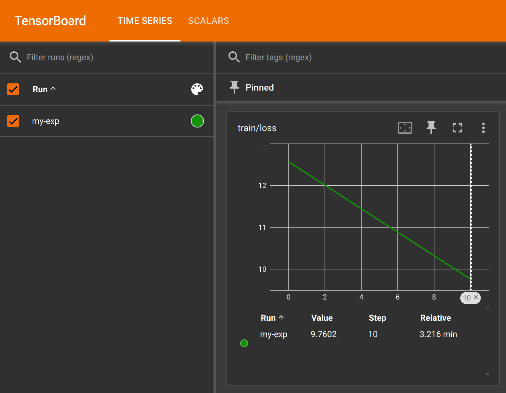

# How to view metrics on tensorboard

The `torch_xla_models/train.py` trainer writes tensorboard metrics for each
experiment under `${output_dir}/runs`, where `output_dir` comes from the Hydra
config.

You may customize the name of the experiment by setting the `run_name` option.
If left unspecified, the run name defaults to the current date and time.

You may also turn up the metrics logging frequency by reducing `logging_steps`.

Example:

```sh
torchprime/torch_xla_models/train.py run_name=my-exp logging_steps=1
```

The metrics contains `loss` and `learning_rate` etc. and you can visualize their
progression by starting a tensorboard web server:

```sh
tensorboard --logdir outputs/runs --port=6006
```

If you're starting tensorboard on a remote VM, you may use VSCode or SSH to
forward its HTTP port (typically `6006`) to your local machine, and then open
the prompted link on your browser. You should expect to see something like this:



## Viewing tensorboard metrics in distributed training

It's also possible to view tensorboard metrics written by a distributed training
job. `tensorboard` natively supports reading summaries from Google Cloud Storage
buckets.

1. Launch a distributed training job using `tp run`.

1. Locate the output directory of your training job. For example, if you
   configured the artifact storage location to `gs://torchprime/my-exp` during
   `tp use`, the output directory may look like:

   ```
   gs://torchprime/my-exp/my-xpk-v6e-4-1-20250604-005509/outputs/0-0
   ```
 
   where `0-0` indicates the first host of the first slice.
 
   You may provide a `--name [some-name]` argument to `tp run` to simplify the
   discovery of the output directory.

1. Launch tensorboard with the `runs` subdirectory relative to the output.
   Example:

   ```sh
   tensorboard \
       --logdir gs://torchprime/my-exp/my-xpk-v6e-4-1-20250604-005509/outputs/0-0/runs \
       --port=6006
   ```
