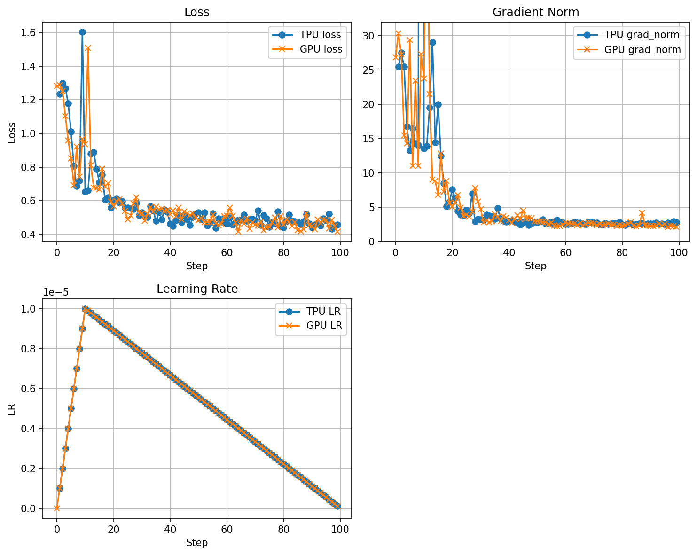

This folder contains minimal GPU training scripts that mirror the TPU examples
in ``torchprime``. They are handy for quickly comparing performance and
behavior between a standard HuggingFace GPU workflow and the TPU training
pipeline.

### GPU run with transformers
Set up a GPU VM on GCP and run:
```
torchrun --nproc_per_node=4 torchprime/experimental/torchrun_gpu_sft/run_sft_gsm8k.py
```

### TPU run with torchprime
Set up a TPU VM on GCP and run:
```
python torchprime/torch_xla_models/train.py --config-name llama-3-8b-sft-w-gsm8k task.convert_to_safetensors=False task.export_checkpoint_path=null task.max_steps=100 task.optimizer.learning_rate=1.e-5 ici_mesh.fsdp=4 dcn_mesh.data=1 logging_steps=1
```

### Compare the training metrics
Update metrics to ``data_hf.txt`` and ``data_tp.txt`` and then run:
```
python torchprime/experimental/torchrun_gpu_sft/draw_figure.py
```
And you will get a figure like this:

