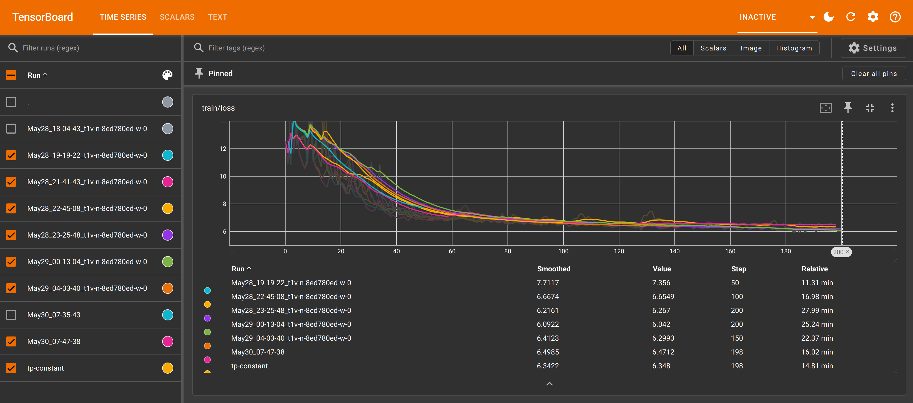

# Run huggingface transformer models

For contributors to torchprime, `tp run` also supports running the huggingface
trainer, for debugging and comparison. This module implements an adapter over
the huggingface trainer.

To run the huggingface trainer, you can clone
[huggingface/transformers][hf-transformers] under the root directory of
torchprime and name it as `local_transformers`. This allows you to pick any
branch or make code modifications in transformers for experiment:

```sh
# Use the official Hugging Face repo.
git clone https://github.com/huggingface/transformers.git local_transformers

# Alternatively, use a TPU-specific fork.
git clone --branch flash_attention https://github.com/pytorch-tpu/transformers.git local_transformers
```

If huggingface transformer doesn't exist, torchprime will automatically clone
the repo and build the docker for experiment. To switch to huggingface models,
add flag `--use-hf` to `tp run` command:

```sh
tp run --use-hf torchprime/hf_models/train.py
```

You may override the arguments to the Hugging Face training script via the Hydra
config syntax. Examples:

```sh
# Run Llama 3.1 405B Hugging Face distributed training on an XPK cluster.
tp run --use-hf torchprime/hf_models/train.py \
    train_script.args.config_name=torchprime/hf_models/configs/model/llama-3/config_405b.json \
    train_script.args.per_device_train_batch_size=64 \
    train_script.args.fsdp_config=null \
    train_script.args.fsdp=null \
    train_script.args.tokenizer_name="meta-llama/Meta-Llama-3.1-405B" \
    +train_script.args.spmd_2d_sharding=4

# Locally run the Hugging Face trainer and log metrics to tensorboard for analysis.
# By default, `torchprime/hf_models/train.py` will train the model configured
# by `train_script.args.config_name`, which defaults to Llama 3.0 8B.
tp docker-run --use-hf torchprime/hf_models/train.py \
    train_script.args.per_device_train_batch_size=8 \
    train_script.args.logging_strategy=steps \
    +train_script.args.log_loss=true \
    +train_script.args.logging_steps=1 \
    +train_script.args.logging_first_step=true \
    +train_script.args.report_to=tensorboard \
    train_script.args.max_steps=150
```

## Configuring and sharding model in the Hugging Face trainer

The Hugging Face training script takes different command line arguments than the
torchprime trainer. See [`configs/default.yaml`](./configs/default.yaml) for the
default set of command line arguments passed to the Hugging Face trainer.

In particular, sharding is configured with a combination of two flags:

- `fsdp`: `"full_shard"`
- `fsdp_config`: `"torchprime/hf_models/configs/model/llama-3/fsdp_config.json"`.
  This points to a config file that further specifies which layer and how to
  apply FSDP parallelism.

## Viewing tensorboard metrics

The Hugging Face trainer writes tensorboard metrics for each experiment under
`${output_dir}/runs`, where `output_dir` comes from the Hydra config.

The metrics contains `loss` and `learning_rate` etc. and you can visualize their
progression by starting a tensorboard web server:

```sh
tensorboard --logdir outputs/runs
```

If you're starting tensorboard on a remote VM, you may use VSCode or SSH to
forward its HTTP port (typically `6006`) to your local machine, and then open
the prompted link on your browser. You should expect to see something like this
after running a few experiments:



[hf-transformers]: https://github.com/huggingface/transformers
